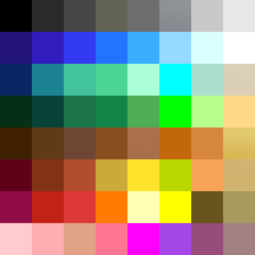

# godot_low_material
Einfache Material Farben von einer Farbpalette für Low-Poly und Low-Material Projekte

## Farbpalette

Horizontal
1. Reihe - Stein, Asphalt, Mauern usw..
2. Reihe Wasser und Eis
3. und 4. Reihe Natur
5. Reihe Holz
6. Reihe Ton, Ziegel
7. Reihe sonstige Farben
8. Reihe Skin-Farben

Vertikal
letzte Reihe Metalle
 
